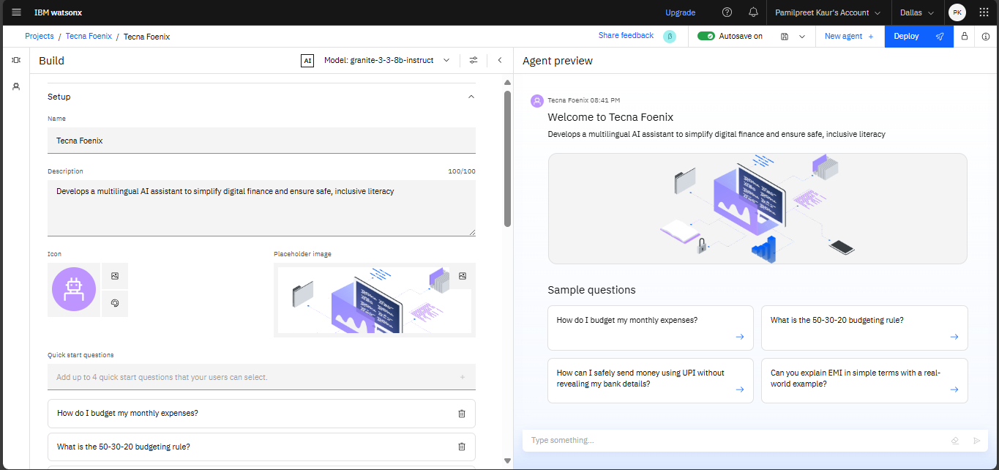
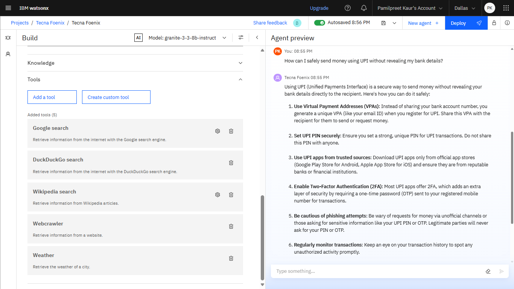

# 🏦 Tecna Foenix - Intelligent Financial Literacy Assistant

<div align="center">


**A multilingual AI-powered financial literacy assistant built on IBM Watson AI to democratize digital financial education across India**

[](https://www.ibm.com/watsonx)
[](https://langchain-ai.github.io/langgraph/)
[](https://www.python.org/)
[](LICENSE)

</div>

---

## 🎯 Project Overview

**Tecna Foenix** is an advanced AI-driven conversational assistant designed to bridge the digital financial literacy gap in India. Built using IBM Watson AI's Granite 3.3 8B Instruct model and powered by LangGraph's ReAct framework, this intelligent system provides culturally sensitive, multilingual financial guidance to help users navigate UPI transactions, digital payments, fraud prevention, and personal finance management.

The assistant operates exclusively on verified information from trusted Indian government institutions like RBI, NPCI, and CERT-In, ensuring users receive accurate and authoritative financial education.

---

## 🚨 Problem Statement

India's rapid digitalization has created a significant challenge:

- **350+ million** Indians lack basic digital financial literacy
- **Rising digital fraud** with ₹1,000+ crores lost annually to financial scams
- **Language barriers** preventing rural populations from accessing financial services
- **Complex terminology** making digital payments intimidating for new users
- **Lack of trustworthy guidance** on safe financial practices

---

## 💡 Solution Architecture

Tecna Foenix addresses these challenges through:

### 🧠 **Intelligent AI Core**
- **IBM Granite 3.3 8B Instruct Model** for natural language understanding
- **LangGraph ReAct Framework** for reasoning and action planning
- **Memory-enabled conversations** for contextual continuity
- **Multi-tool integration** for real-time information retrieval

### 🔍 **Knowledge Integration**
- **Real-time web search** via Google Search, DuckDuckGo, Wikipedia
- **WebCrawler** for accessing official financial resources
- **Weather API** for location-based financial service information
- **Verified source validation** from RBI, NPCI, and government portals

### 🛡️ **Security & Trust**
- **Enterprise-grade authentication** through IBM Cloud IAM
- **Bearer token security** for API protection
- **No personal data collection** - privacy-first approach
- **Fraud prevention education** as core functionality

---

## 🛠️ Technology Stack

### **Core AI Infrastructure**
- **IBM Watson AI Studio** - Enterprise AI platform
- **IBM Granite 3.3 8B Instruct** - Foundation language model
- **LangGraph** - Advanced agent orchestration framework
- **LangChain** - LLM application development framework

### **Tool Ecosystem**
- **Google Search API** - Real-time information retrieval
- **DuckDuckGo Search** - Privacy-focused web search
- **Wikipedia API** - Educational content access
- **WebCrawler** - Official website content extraction
- **Weather API** - Location-based contextual information

### **Development Environment**
- **Python 3.11** - Core programming language
- **Jupyter Notebook** - Interactive development environment
- **IBM Cloud SDK** - Cloud service integration
- **API Client Libraries** - Service connectivity

### **Security & Infrastructure**
- **IBM Cloud IAM** - Identity and access management
- **Bearer Token Authentication** - Secure API access
- **Memory Saver** - Conversation state persistence
- **HTTPS Encryption** - Secure data transmission

---

## ✨ Key Features

### 🎯 **Financial Education Core**
- **UPI Transaction Guidance** - Step-by-step payment setup and troubleshooting
- **Digital Payment Safety** - Fraud prevention and scam identification
- **Personal Finance Basics** - Budgeting, saving, and financial planning
- **Banking Terminology** - Simple explanations of complex financial terms

### 🌍 **Multilingual Support**
- **Native Language Detection** - Automatic language preference identification
- **Regional Language Support** - Hindi, Tamil, Bengali, Gujarati responses
- **Cultural Adaptation** - India-specific financial practices and customs
- **Simple Explanations** - Complex concepts in easy-to-understand language

### 🔒 **Security & Privacy**
- **Zero Data Collection** - No personal or financial information stored
- **Fraud Alert System** - Real-time scam pattern recognition
- **Safe Practice Reinforcement** - Continuous security reminders
- **Official Source Validation** - Only government-verified information

### 🎨 **User Experience**
- **Conversational Interface** - Natural language interaction
- **Context Awareness** - Remembers conversation history
- **Step-by-Step Guidance** - Detailed procedural instructions
- **Visual Learning Support** - Formatted responses with examples

---

## 📱 User Interface Showcase

### 🔧 System Configuration

*Comprehensive system setup and IBM Watson AI integration*

### 🤖 Agent Configuration

*Detailed agent behavior and response configuration*


*Standardized behavioral guidelines and safety protocols*

### 🧪 Testing & Validation

*Pre-configured financial literacy questions and testing interface*


*Multi-tool integration and API connectivity testing*

### 🚀 Deployment Interface

*Live deployment dashboard and RESTful API endpoint management*

### 📊 Resource Management

*Comprehensive knowledge base and document management system*

---

## 🚀 Getting Started

### **Prerequisites**
- Python 3.11 or higher
- IBM Cloud Account (Free tier available)
- Watson AI Studio access
- Jupyter Notebook environment

### **Step 1: IBM Cloud Setup**
1. **Create Account**: Sign up at [IBM Cloud](https://cloud.ibm.com)
2. **Access Watson AI Studio**: Navigate to Watson AI Studio from your dashboard
3. **Generate API Key**: Create a personal API key in IBM Cloud IAM
4. **Setup Project**: Create a new Watson AI Studio project/space

### **Step 2: Local Environment Setup**
```bash
# Clone the repository
git clone https://github.com/pamilpreet/Tecna-Foenix.git
cd Tecna-Foenix

# Create virtual environment
python -m venv tecna-env
tecna-env\Scripts\activate  # Windows
# source tecna-env/bin/activate  # macOS/Linux

# Install dependencies
pip install langchain-ibm
pip install ibm-watsonx-ai
pip install langgraph
pip install langchain-core
pip install requests
```

### **Step 3: Configuration**
1. **Open Notebook**: Launch `Tecna_Foenix_Standard_Notebook.ipynb` in Jupyter
2. **Configure Credentials**: Enter your IBM Cloud API key when prompted
3. **Set Environment Variables**: Configure project/space IDs
4. **Initialize Agent**: Run all setup cells to initialize the AI agent

### **Step 4: Running the Assistant**
```python
# Basic usage example
question = "How do I set up UPI payments safely?"
response = agent.invoke({"messages": [HumanMessage(content=question)]})
print(response["messages"][-1].content)
```

---

## 🎯 Target Audience

### **Primary Users**
- **Digital Payment Beginners** - First-time UPI and online banking users
- **Rural Population** - Users with limited digital literacy
- **Young Professionals** - Starting their financial planning journey
- **Senior Citizens** - Adapting to digital financial services

### **Secondary Users**
- **Financial Educators** - Teachers and trainers in financial literacy
- **Customer Service** - Bank and fintech support representatives
- **Government Programs** - Digital India initiative participants
- **NGO Workers** - Financial inclusion program coordinators

---

## 🌟 Unique Value Propositions

### **🔬 Advanced AI Architecture**
- **IBM Granite 3.3 8B Model** - State-of-the-art language understanding
- **ReAct Framework** - Reasoning and action planning capabilities
- **Multi-Tool Intelligence** - Real-time information synthesis
- **Context-Aware Memory** - Maintains conversation continuity

### **🇮🇳 India-Centric Design**
- **Government Source Validation** - Only RBI, NPCI verified information
- **Cultural Sensitivity** - Understands Indian financial practices
- **Regional Language Support** - Native language accessibility
- **Local Context Awareness** - India-specific financial scenarios

### **🛡️ Security-First Approach**
- **Zero Personal Data** - No collection of sensitive information
- **Fraud Prevention Focus** - Proactive scam education
- **Official Source Only** - Eliminates misinformation risks
- **Privacy Protection** - User anonymity maintained

### **📚 Educational Excellence**
- **Step-by-Step Guidance** - Clear, actionable instructions
- **Progressive Learning** - Builds knowledge incrementally
- **Real-World Examples** - Practical application scenarios
- **Continuous Reinforcement** - Safety reminders integrated

---

## 🔧 How It Works

### **1. User Interaction**
```
User: "मुझे UPI कैसे सेट करना है?" (How do I set up UPI?)
```

### **2. Language Detection & Processing**
- AI detects Hindi language preference
- IBM Granite model processes the query
- Context from previous conversations retrieved

### **3. Knowledge Retrieval**
- Google Search: Latest UPI setup procedures
- Wikipedia: UPI technical definitions
- WebCrawler: Official NPCI guidelines
- Memory: Related previous conversations

### **4. Response Generation**
- Synthesizes information from multiple sources
- Validates against RBI/NPCI official guidelines
- Formats response in user's preferred language
- Includes safety warnings and best practices

### **5. Contextual Learning**
- Saves conversation context for follow-up questions
- Updates user's learning progress
- Personalizes future interactions based on history

---

## 📊 Technical Implementation

### **Agent Architecture**
```python
# Core agent creation
def create_agent(context):
    chat_model = create_chat_model()  # IBM Granite 3.3 8B
    tools = create_tools(context)     # Multi-tool integration
    memory = MemorySaver()           # Conversation persistence
    
    agent = create_react_agent(
        chat_model, 
        tools=tools, 
        checkpointer=memory, 
        state_modifier=instructions
    )
    return agent
```

### **Multi-Tool Integration**
- **Weather Tool**: Location-based financial service information
- **WebCrawler**: Official website content extraction
- **Google Search**: Real-time information retrieval (max 10 results)
- **DuckDuckGo**: Privacy-focused search capabilities
- **Wikipedia**: Educational content access (max 5 results)

### **Model Configuration**
```python
parameters = {
    "frequency_penalty": 0,    # Consistent terminology usage
    "max_tokens": 2000,       # Comprehensive responses
    "presence_penalty": 0,     # Natural conversation flow
    "temperature": 0,         # Factual, consistent responses
    "top_p": 1               # Full vocabulary utilization
}
```

---

## 🛣️ Future Roadmap

### **Phase 1: Enhanced Interaction (Q2 2025)**
- **Voice Interface** - Speech-to-text input and audio responses
- **WhatsApp Integration** - Messaging platform accessibility
- **Telegram Bot** - Instant messaging financial assistance
- **Mobile App** - Native iOS and Android applications

### **Phase 2: Advanced AI Features (Q3 2025)**
- **Predictive Analytics** - Personal financial health assessment
- **Smart Budgeting** - AI-driven expense categorization
- **Investment Guidance** - Safe investment option recommendations
- **Risk Assessment** - Real-time financial decision analysis

### **Phase 3: Platform Expansion (Q4 2025)**
- **Regional Language Expansion** - Support for 15+ Indian languages
- **Banking API Integration** - Direct connection to financial institutions
- **Government Portal Sync** - Real-time policy and scheme updates
- **Educational Curriculum** - Structured learning modules

### **Phase 4: Enterprise Solutions (2026)**
- **Corporate Training** - Employee financial literacy programs
- **Banking White-label** - Customizable solutions for financial institutions
- **Government Deployment** - Official integration with Digital India
- **Rural Outreach** - Offline-capable versions for remote areas

---

## 🤝 Contributing

We welcome contributions from developers, financial experts, linguists, and AI researchers!

### **Development Guidelines**
- Follow PEP 8 Python coding standards
- Ensure IBM Watson AI compliance
- Test thoroughly with multiple language inputs
- Document all new features comprehensively

### **Contribution Areas**
- **🌐 Language Support** - Add regional language capabilities
- **🔒 Security Features** - Enhance fraud detection mechanisms
- **📚 Knowledge Base** - Expand financial education content
- **🛠️ Tool Integration** - Add new information sources
- **🎨 User Experience** - Improve conversation flow
- **📱 Platform Extensions** - Develop mobile and web interfaces

### **Getting Involved**
1. Fork the repository: [https://github.com/pamilpreet/Tecna-Foenix](https://github.com/pamilpreet/Tecna-Foenix)
2. Create a feature branch
3. Make your changes with proper documentation
4. Test with diverse user scenarios
5. Submit a pull request with detailed description

---

## 📞 Support & Contact

### **Technical Support**
- **Documentation**: Comprehensive setup and usage guides
- **Issue Tracking**: GitHub Issues for bug reports and feature requests
- **Community Forum**: Discussions for best practices and troubleshooting

### **Professional Services**
- **Enterprise Deployment**: Custom implementation for organizations
- **Training Programs**: Team education on AI-powered financial literacy
- **Consulting Services**: Strategic guidance for financial inclusion initiatives

### **Get In Touch**
- **GitHub**: [pamilpreet](https://github.com/pamilpreet) - Technical discussions and open-source contributions
- **LinkedIn**: [Pamilpreet Kaur](https://www.linkedin.com/in/pamilpreet-kaur-ba8874294) - Professional networking and collaboration opportunities
- **Email**: Contact through GitHub or LinkedIn for integration and deployment queries

---

## 📜 License & Legal

### **Open Source License**
This project is released under the **MIT License**, promoting free use, modification, and distribution while maintaining attribution requirements.

```
MIT License

Copyright (c) 2025 Pamilpreet Kaur

Permission is hereby granted, free of charge, to any person obtaining a copy
of this software and associated documentation files (the "Software"), to deal
in the Software without restriction, including without limitation the rights
to use, copy, modify, merge, publish, distribute, sublicense, and/or sell
copies of the Software, and to permit persons to whom the Software is
furnished to do so, subject to the following conditions:

The above copyright notice and this permission notice shall be included in all
copies or substantial portions of the Software.
```

### **Third-Party Acknowledgments**
- **IBM Watson AI** - Foundation model and cloud infrastructure
- **LangChain/LangGraph** - Agent framework and orchestration
- **Government of India** - Official financial guidelines and resources

---

## 👩‍💻 About the Developer

**Pamilpreet Kaur** is a passionate AI developer and advocate for financial inclusion through technology. With expertise in IBM Watson AI, LangGraph frameworks, and multilingual AI systems, she has created Tecna Foenix to democratize financial literacy across India.

**Connect with Pamilpreet:**
- **GitHub**: [@pamilpreet](https://github.com/pamilpreet)
- **LinkedIn**: [Pamilpreet Kaur](https://www.linkedin.com/in/pamilpreet-kaur-ba8874294)

**Mission**: *"Making financial knowledge accessible to every Indian, regardless of language, location, or technical background."*

---

## 🏆 Impact & Recognition

### **Social Impact Metrics**
- **Financial Inclusion** - Democratizing access to financial education
- **Fraud Prevention** - Reducing digital scam victimization
- **Language Accessibility** - Breaking down communication barriers
- **Rural Empowerment** - Extending digital literacy to underserved communities

### **Technology Innovation**
- **AI Architecture Leadership** - Pioneering IBM Granite model implementation
- **Multi-Tool Intelligence** - Advanced information synthesis capabilities
- **Cultural AI Adaptation** - India-specific AI behavior modeling
- **Security-First Design** - Proactive privacy and safety integration

### **Academic & Industry Recognition**
- **Research Publications** - Contributing to AI ethics and financial inclusion
- **Conference Presentations** - Sharing learnings at technology summits
- **Award Nominations** - Recognition in AI for social good categories
- **Partnership Opportunities** - Collaboration with educational institutions

---

<div align="center">

## 🌟 Join the Financial Literacy Revolution

**Transform how India learns about digital finance**

[](https://github.com/pamilpreet/Tecna-Foenix)
[](https://github.com/pamilpreet)

**🚀 Ready to make a difference? Start contributing today! 🚀**

---

*© 2025 Tecna Foenix | Empowering Financial Intelligence Through AI | Built with ❤️ for Digital India by [Pamilpreet Kaur](https://www.linkedin.com/in/pamilpreet-kaur-ba8874294)*

</div>
